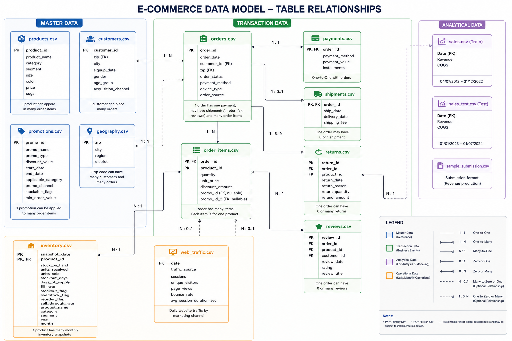

# E-Commerce Growth: End-to-end analytics from customer journey, to operation optimization and time-series sales prediction 

## 1. Business Context & Project Overview

This project analyzes the end-to-end operations of a fashion e-commerce company in Vietnam, covering the period from **July 4, 2012 to July 1, 2024**.

The objective is to leverage data to:
- Understand the **customer journey (user funnel)** from acquisition to retention
- Identify opportunities to **grow the customer base and improve retention**
- Evaluate **marketing channel effectiveness**
- Optimize **operations (logistics, inventory, fulfillment)**
- Detect bottlenecks in **returns and customer experience**
- Forecast **daily revenue** for strategic planning

The dataset simulates real-world business operations and is structured across four layers:
- **Master Data** (reference data)
- **Transaction Data** (business events)
- **Analytical Data** (aggregated metrics)
- **Operational Data** (inventory & web traffic)

---

### Dataset Overview

Below is the entity-relationship diagram describing the data model and table relationships:

---

## 2. Executive Summary

<!-- To be completed -->

---

## 3. Metrics / Terms Definition

### Customer Funnel Metrics
- **Acquisition**: Number of new users (based on `signup_date`)
- **Activation Rate**: % of users who place at least one order after signup
- **Conversion Rate**: Orders / Website sessions
- **Retention Rate**: % of users returning after first purchase
- **Churn Rate**: Users inactive after a defined period (e.g., 90 days)

### Revenue Metrics
- **Gross Merchandise Value (GMV)**: Total order value before discounts
- **Net Revenue**: Revenue after discounts and returns
- **Average Order Value (AOV)**: Revenue / Number of orders
- **Customer Lifetime Value (CLV)**: Total revenue per customer

### Marketing Metrics
- **Customer Acquisition Cost (CAC)**: <!-- To be completed -->
- **Channel Conversion Rate**: Orders per acquisition channel
- **Traffic Conversion Rate**: Orders / Sessions (from web traffic)

### Operational Metrics
- **Order Fulfillment Time**: Delivery date - Order date
- **On-time Delivery Rate**: <!-- To be completed -->
- **Fill Rate**: % of demand fulfilled from inventory
- **Stockout Rate**: % of time products are unavailable

### Return & Quality Metrics
- **Return Rate**: Returned items / Sold items
- **Refund Ratio**: Refund amount / Revenue
- **Average Rating**: Mean customer rating (1–5)

---

## 4. Approach

### 4.1 Data Preparation
- Data cleaning and validation across 15 CSV files
- Handling missing values (e.g., gender, acquisition channel)
- Ensuring referential integrity across tables
- Feature engineering for:
  - Customer lifecycle
  - Order-level metrics
  - Time-based aggregations

---

### 4.2 User Funnel Analysis
- Map customer journey:
  - Traffic → Signup → First Purchase → Repeat Purchase
- Segment users by:
  - Acquisition channel
  - Demographics
  - Behavior (frequency, recency)
- Identify drop-off points in the funnel

---

### 4.3 Acquisition & Growth Analysis
- Evaluate performance of acquisition channels
- Compare:
  - Conversion rates
  - Customer quality (AOV, retention)
- Analyze impact of promotions on:
  - New user growth
  - Order volume

---

### 4.4 Retention & Customer Segmentation
- Cohort analysis (by signup date)
- RFM segmentation:
  - Recency
  - Frequency
  - Monetary value
- Identify high-value and at-risk customers

---

### 4.5 Customer Persona Development
- Profile target customers based on:
  - Demographics
  - Purchase behavior
  - Product preferences
- Define actionable personas for marketing strategies

---

### 4.6 Operations & Supply Chain Analysis
- Inventory efficiency:
  - Stock levels vs demand
  - Stockout and overstock patterns
- Logistics performance:
  - Delivery time distribution
  - Shipping cost analysis
- Identify operational bottlenecks

---

### 4.7 Returns Analysis
- Analyze return patterns by:
  - Product category
  - Customer segment
  - Reason for return
- Identify root causes of high return rates

---

### 4.8 Revenue Forecasting
- Time series modeling on daily revenue
- Train/Test split:
  - Train: 2012–2022
  - Test: 2023–2024
- Evaluate models:
  - <!-- To be completed -->
- Generate forecasts for business planning

---

## 5. Key Takeaways

<!-- To be completed -->

## 7. Project Structure
